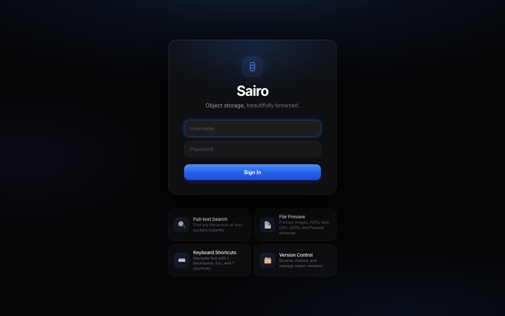
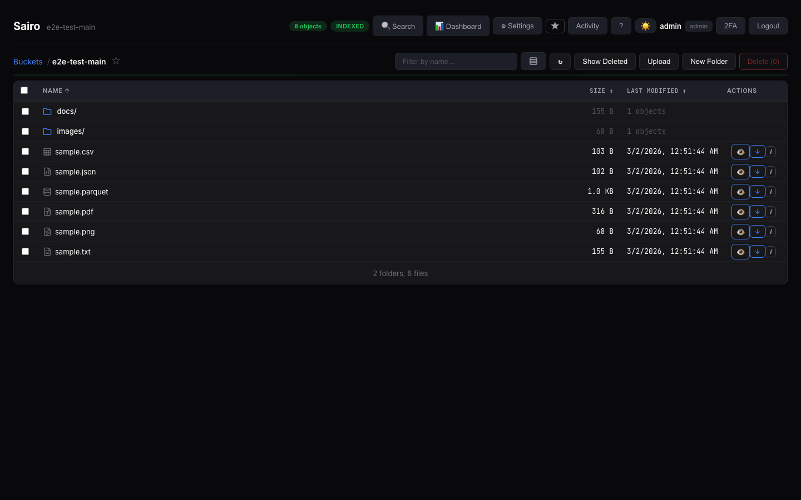
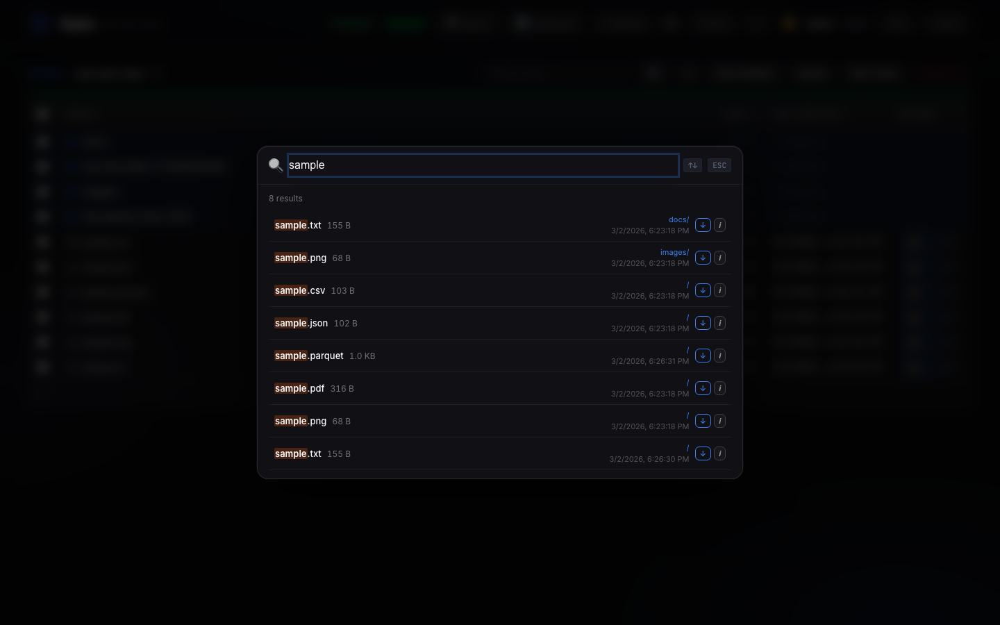
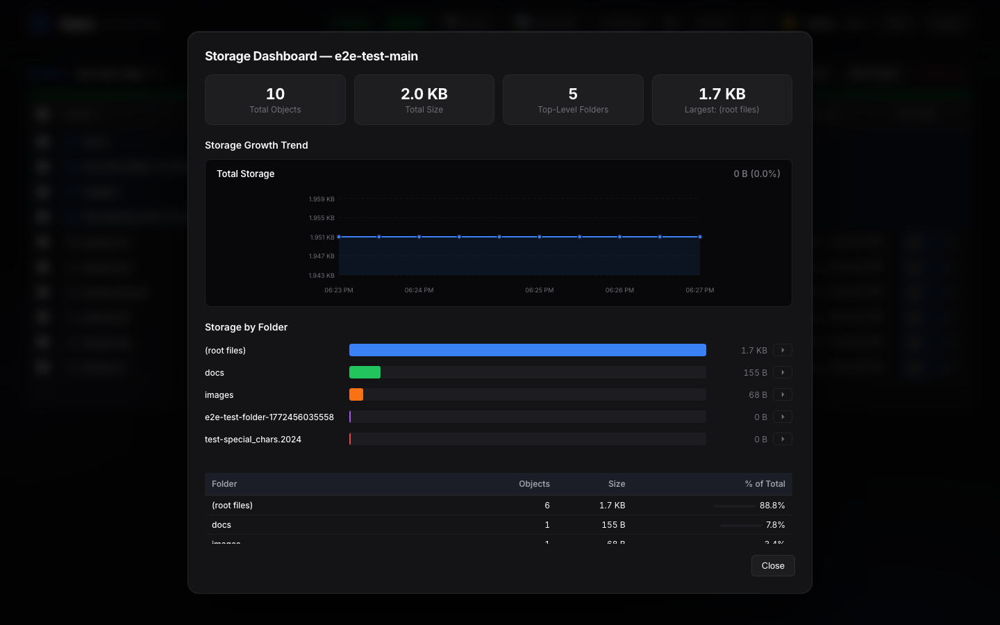
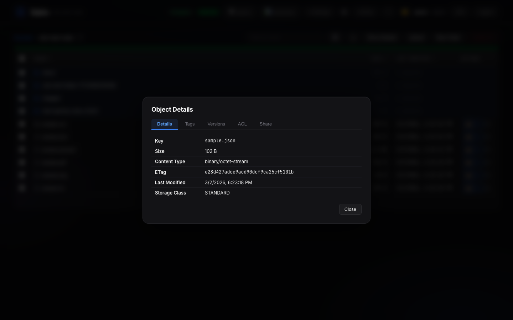

# Sairo

[](https://github.com/AshwathStephen/sairo/actions/workflows/docker.yaml)
[](https://github.com/AshwathStephen/sairo/actions/workflows/helm.yaml)
[](https://hub.docker.com/r/stephenjr002/sairo)
[](https://github.com/AshwathStephen/sairo/releases)
[](LICENSE)

A self-hosted, S3-compatible object storage browser. Browse, search, and manage any S3-compatible storage from your browser. Built for petabyte scale.

Works with **AWS S3**, **MinIO**, **Ceph**, **Wasabi**, **Cloudflare R2**, **Backblaze B2**, **Leaseweb**, **NetApp StorageGRID**, and any S3-compatible endpoint.

## Demo


## Screenshots



| | |
|---|---|
|  |  |
|  |  |
|  |  |

## Features

- **Object Browser** — Navigate buckets and prefixes with virtual scrolling for 100K+ objects
- **Instant Search** — SQLite-indexed search across all objects by filename, kept fresh on large buckets by an adaptive delta crawler that re-lists only the newest prefixes
- **File Preview** — Images, text, CSV, JSON, PDF, Parquet/ORC/Avro schemas, and binary hex
- **Upload & Download** — Direct browser-to-S3 upload for files of any size (presigned multipart, no data through the server), drag-and-drop with progress, and presigned-URL downloads
- **Storage Dashboard** — Visual breakdown by prefix with growth trend charts and cost estimates
- **Cost Intelligence** — Per-folder cost breakdown with provider comparison. AWS pricing fetched live; others from community data
- **Version Management** — Browse, restore, delete, and purge individual object versions
- **Version Scanner** — Background scan reveals hidden delete markers and ghost objects
- **Bucket Management** — Versioning, lifecycle rules, CORS, ACLs, policies, tagging, object lock
- **Object Operations** — Copy, move, rename, delete (files and folders, bulk)
- **Share Links** — Password-protected share links with configurable expiration
- **Multi-Endpoint** — Connect multiple S3 backends and manage all from one dashboard
- **Audit Log** — Full activity trail with filtering by action, user, and bucket
- **User Management** — Role-based access control (admin / viewer) with per-bucket permissions
- **S3-Key Auth** — Optional `AUTH_MODE=s3`: users log in with their own S3 keys and see only the buckets their provider IAM allows — access is delegated entirely to the provider
- **Two-Factor Auth** — TOTP-based 2FA with QR setup and recovery codes
- **SSO — OAuth, OIDC & LDAP** — Google/GitHub OAuth, generic OpenID Connect (Keycloak, Okta, Auth0, Entra ID, Google, Authentik, Dex, …) with auto-discovery + full ID-token validation (PKCE, nonce, JWKS), and LDAP. OIDC syncs the username only; admins assign per-bucket access. **Setup guide: [docs/SSO.md](docs/SSO.md)**
- **AI-Powered Analysis (MCP)** — Connect Claude, Cursor, or any MCP client to ask natural language questions about your storage. 26 tools for analytics, cost optimization, pipeline health, and more
- **Petabyte-Scale Performance** — Proven on a live 269 TB / 15.5M-object deployment. Constant-time folder listing at any scale via pre-computed prefix hierarchies, 64MB SQLite page cache, 256MB memory-mapped I/O, async FTS rebuilds
- **Anonymous Telemetry (opt-out)** — A privacy-first heartbeat reports aggregate counts, instance health, and activation timestamps only (never names, keys, paths, or content). Disable with `TELEMETRY=false`
- **Dark Mode** — Full dark/light theme with system preference detection
- **Keyboard Shortcuts** — 30+ shortcuts for power users
- **Single Container** — No dependencies. No microservices. Just `docker run` and go.

## Quick Start

### Docker

```bash
docker run -d --name sairo -p 8000:8000 \
  -e S3_ENDPOINT=https://your-s3-endpoint.com \
  -e S3_ACCESS_KEY=your-access-key \
  -e S3_SECRET_KEY=your-secret-key \
  -e ADMIN_PASS=choose-a-strong-password \
  -e JWT_SECRET=$(openssl rand -hex 32) \
  -v sairo-data:/data \
  stephenjr002/sairo
```

Then open `http://localhost:8000` and log in with `admin` / your chosen password.

### Docker Compose

```bash
cp .env.example .env
# Edit .env with your S3 credentials
docker compose up -d
```

### Helm

```bash
helm install sairo oci://registry-1.docker.io/stephenjr002/sairo-helm \
  --namespace sairo \
  --create-namespace \
  --set s3.endpoint=https://your-s3-endpoint.com \
  --set s3.accessKey=your-access-key \
  --set s3.secretKey=your-secret-key \
  --set auth.adminPass=choose-a-strong-password \
  --set auth.jwtSecret=$(openssl rand -hex 32)
```

## AI Storage Intelligence (MCP)

Sairo includes an optional MCP (Model Context Protocol) server that lets AI assistants analyze your storage infrastructure. Deploy it as a sidecar alongside Sairo.

```bash
# Uncomment sairo-mcp in docker-compose.yml, then:
docker compose up -d
```

Connect Claude Desktop, Cursor, or any MCP-compatible client and ask:

- *"What buckets do I have?"* — Lists all buckets with sizes and status
- *"What's eating all the space?"* — Storage breakdown by folder with percentages
- *"How much is this costing me?"* — Cost estimates across AWS, R2, B2, Wasabi, Leaseweb
- *"Find all parquet files"* — Full-text search across millions of objects
- *"Are there any duplicates?"* — Finds redundant files with estimated savings
- *"Is my data pipeline still running?"* — Freshness check per folder
- *"Run a full storage audit"* — 7-step analysis with actionable recommendations

**26 tools, 4 guided workflows, zero configuration.** The AI picks the right tools automatically.

## Performance

Validated read-only against a live production deployment (Leaseweb S3-compatible storage):

| Operation | Result |
|-----------|--------|
| Production scale | **15.5M objects across 14 buckets, ~269 TB** |
| Largest single bucket | **~9.86M objects** |
| Folder listing | **Constant-time** — lands at the network floor even on the 9.86M-object bucket (≈0ms server-side) |
| Full-text search | Single-digit ms on 100K+ objects; tens of ms server-side at ~10M objects |
| Upload | Direct browser→S3 multipart, up to 5 TB/object, **flat server memory** |
| Crawl throughput | 16 parallel prefix workers, 10K batch inserts, adaptive delta crawl |

**Scaling:** Folder navigation is a constant-time index lookup, so it stays instant at any dataset size. See [benchmark results](benchmark/results/LATEST-RESULTS.md) for the full methodology and server-compute microbenchmarks.

## Environment Variables

| Variable | Default | Description |
|----------|---------|-------------|
| `S3_ENDPOINT` | **(required)** | S3-compatible endpoint URL |
| `S3_ACCESS_KEY` | (required) | S3 access key |
| `S3_SECRET_KEY` | (required) | S3 secret key |
| `S3_REGION` | _(empty)_ | S3 region (if required by provider) |
| `AUTH_MODE` | `local` | Auth mode: `local` (username/password) or `s3` (S3 access key/secret key) |
| `ADMIN_USER` | `admin` | Default admin username (first run only) |
| `ADMIN_PASS` | (auto-generated) | Default admin password (first run only) |
| `JWT_SECRET` | (auto-generated) | Secret for signing JWT tokens. Set for persistent sessions |
| `SESSION_HOURS` | `24` | Login session duration in hours |
| `SECURE_COOKIE` | `true` | Set to `false` for HTTP (non-HTTPS) deployments |
| `RECRAWL_INTERVAL` | `120` | Seconds between automatic re-index cycles |
| `LARGE_BUCKET_SECONDS` | `60` | A bucket whose full crawl exceeds this is kept fresh via incremental delta crawls instead of full re-crawls |
| `FULL_CRAWL_INTERVAL` | `3600` | Seconds between full reconcile crawls for large buckets (delta crawls run in between) |
| `DB_DIR` | `/data` | Directory for SQLite databases |
| `TELEMETRY` | `true` | Anonymous usage heartbeat (aggregate counts + health only). Set `false` to disable |
| `TELEMETRY_INTERVAL` | `3600` | Seconds between telemetry heartbeats |

> This is a summary; see **[.env.example](.env.example)** for the full annotated environment-variable reference (delta-crawl tuning, uploads, LDAP/OAuth, branding, rate limiting). For single sign-on (OIDC / OAuth / LDAP) setup with per-provider examples, see **[docs/SSO.md](docs/SSO.md)**.

## Tech Stack

| Layer | Technology |
|-------|-----------|
| Frontend | React 18, Vite, @tanstack/react-virtual |
| Backend | Python 3.12, FastAPI, Uvicorn |
| S3 Client | boto3 with S3v4 signatures |
| Auth | PyJWT, passlib (bcrypt), pyotp (TOTP), slowapi |
| Database | SQLite (WAL mode, FTS5, 64MB cache, 256MB mmap) per bucket |
| Encryption | Fernet (cryptography) |
| AI / MCP | FastMCP, 26 tools, Streamable HTTP + stdio transports |
| CLI | Go 1.24, Cobra, system keyring integration |
| Container | Multi-stage Docker (node:20 + python:3.12) |

## Pricing Data Sources

Cost estimates in the Storage Dashboard use a hybrid approach:

| Provider | Source | Update Method |
|----------|--------|---------------|
| **AWS S3** | [AWS Bulk Pricing API](https://pricing.us-east-1.amazonaws.com/offers/v1.0/aws/AmazonS3/current/index.json) | Live fetch, cached daily |
| **All others** | [s3compare.io](https://www.s3compare.io/) (CC BY 4.0) + provider docs | Static defaults, admin-overridable |

**Why not all live?** Only AWS exposes a pricing API. Cloudflare R2, Backblaze B2, Wasabi, Leaseweb, and other S3-compatible providers do not have programmatic pricing endpoints. Their prices are published on marketing pages and change infrequently (<1x/year).

**Community help wanted:** If you know of a provider that now offers a pricing API, or if any of the static prices are outdated, please [open an issue](https://github.com/AshwathStephen/sairo/issues) or submit a PR updating `backend/pricing.py`. We want cost estimates to be accurate and will integrate better data sources as they become available.

Supported providers: AWS S3, Cloudflare R2, Backblaze B2, Wasabi, Leaseweb, DigitalOcean Spaces, Hetzner, Scaleway, OVHcloud, iDrive e2, Storj, MinIO, Ceph.
