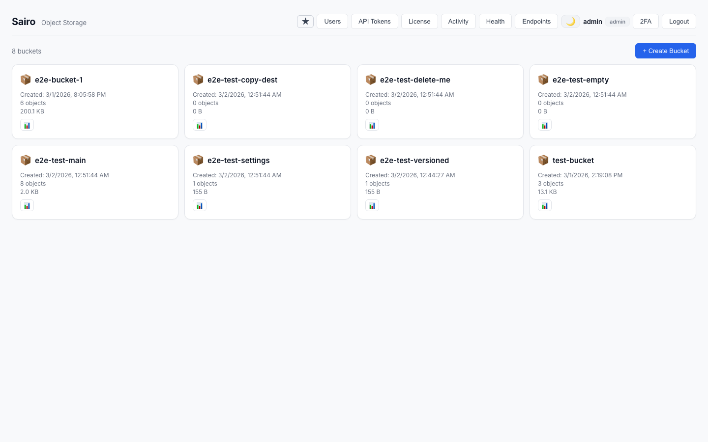
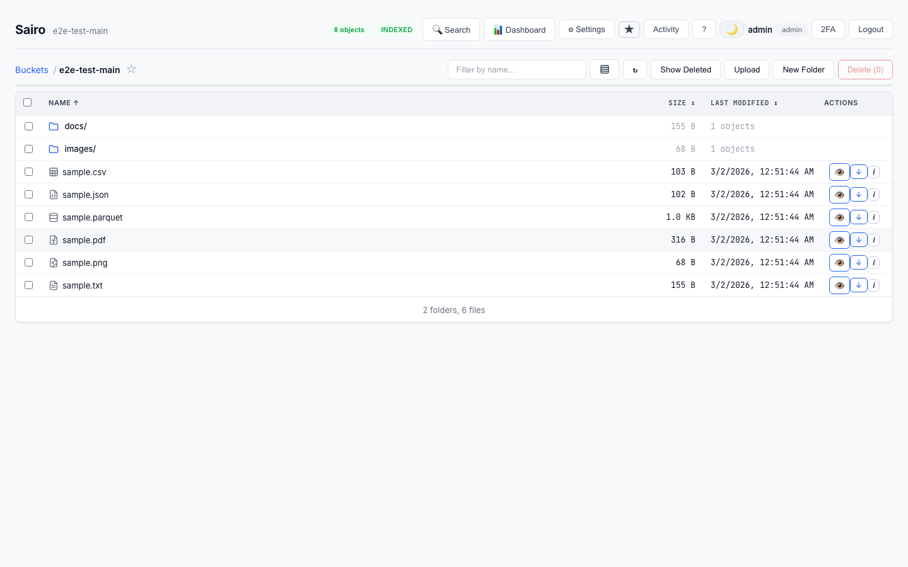
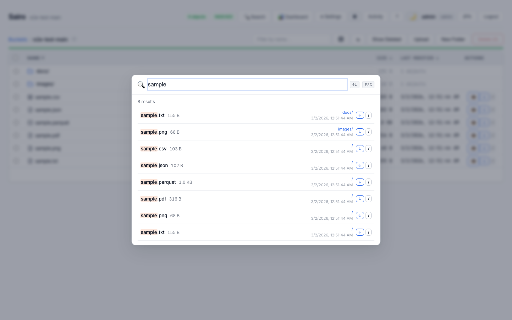
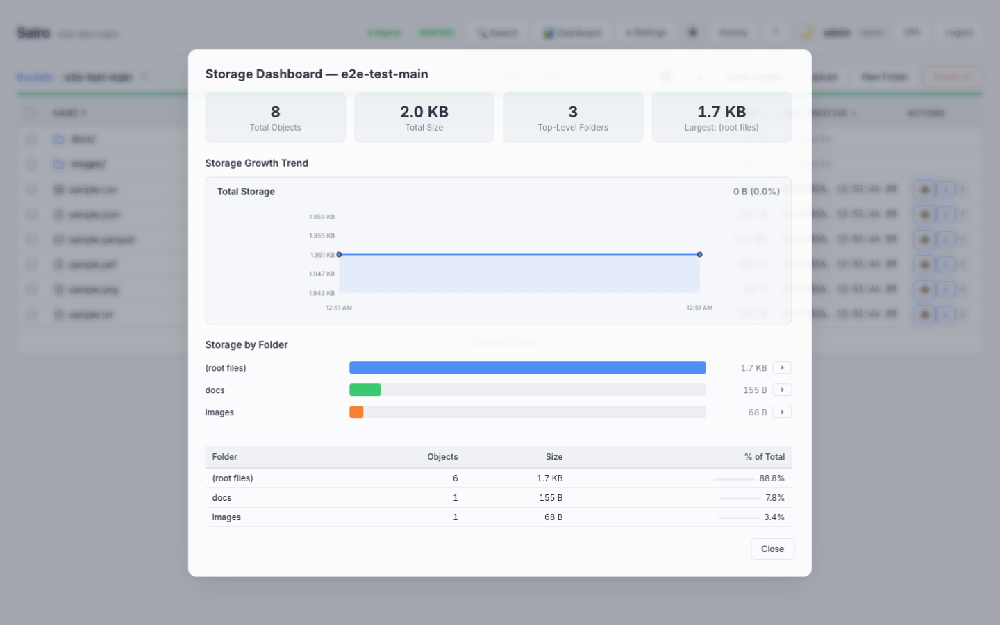
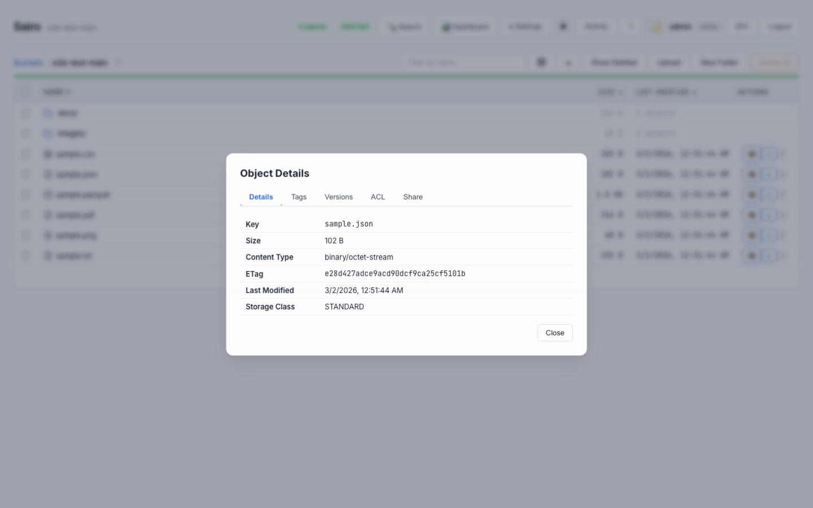
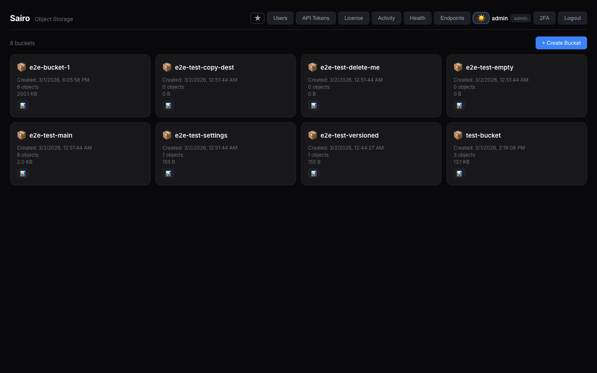

# Sairo

[](https://github.com/AshwathStephen/sairo/actions/workflows/docker.yaml)
[](https://github.com/AshwathStephen/sairo/actions/workflows/helm.yaml)
[](https://hub.docker.com/r/stephenjr002/sairo)
[](https://github.com/AshwathStephen/sairo/releases)
[](LICENSE)

A self-hosted, S3-compatible object storage browser. Browse, search, and manage any S3-compatible storage from your browser.

Works with **AWS S3**, **MinIO**, **Ceph**, **Wasabi**, **Cloudflare R2**, **Backblaze B2**, **Leaseweb**, and any S3-compatible endpoint.

## Demo


## Screenshots

| | |
|---|---|
|  |  |
|  |  |
|  |  |

## Features

- **Object Browser** — Navigate buckets and prefixes with virtual scrolling for 100K+ objects
- **Instant Search** — SQLite-indexed search across all objects by filename
- **File Preview** — Images, text, CSV, JSON, PDF, Parquet/ORC/Avro schemas, and binary hex
- **Upload & Download** — Multipart upload with progress tracking, drag-and-drop support
- **Storage Dashboard** — Visual breakdown by prefix with growth trend charts
- **Version Management** — Browse, restore, delete, and purge individual object versions
- **Version Scanner** — Background scan reveals hidden delete markers and ghost objects
- **Bucket Management** — Versioning, lifecycle rules, CORS, ACLs, policies, tagging, object lock
- **Object Operations** — Copy, move, rename, delete (files and folders, bulk)
- **Share Links** — Password-protected share links with configurable expiration
- **Multi-Endpoint** — Connect multiple S3 backends and manage all from one dashboard
- **Audit Log** — Full activity trail with filtering by action, user, and bucket
- **User Management** — Role-based access control (admin / viewer) with per-bucket permissions
- **Two-Factor Auth** — TOTP-based 2FA with QR setup and recovery codes
- **OAuth & LDAP** — Google, GitHub OAuth and LDAP authentication
- **Dark Mode** — Full dark/light theme with system preference detection
- **Keyboard Shortcuts** — 30+ shortcuts for power users
- **Single Container** — No dependencies. No microservices. Just `docker run` and go.

## Quick Start

### Docker

```bash
docker run -d --name sairo -p 8000:8000 \
  -e S3_ENDPOINT=https://your-s3-endpoint.com \
  -e S3_ACCESS_KEY=your-access-key \
  -e S3_SECRET_KEY=your-secret-key \
  -e ADMIN_PASS=choose-a-strong-password \
  -e JWT_SECRET=$(openssl rand -hex 32) \
  -v sairo-data:/data \
  stephenjr002/sairo
```

Then open `http://localhost:8000` and log in with `admin` / your chosen password.

### Docker Compose

```bash
cp .env.example .env
# Edit .env with your S3 credentials
docker compose up -d
```

### Helm

```bash
helm install sairo oci://registry-1.docker.io/stephenjr002/sairo-helm \
  --namespace sairo \
  --create-namespace \
  --set s3.endpoint=https://your-s3-endpoint.com \
  --set s3.accessKey=your-access-key \
  --set s3.secretKey=your-secret-key \
  --set auth.adminPass=choose-a-strong-password \
  --set auth.jwtSecret=$(openssl rand -hex 32)
```

## Environment Variables

| Variable | Default | Description |
|----------|---------|-------------|
| `S3_ENDPOINT` | **(required)** | S3-compatible endpoint URL |
| `S3_ACCESS_KEY` | (required) | S3 access key |
| `S3_SECRET_KEY` | (required) | S3 secret key |
| `S3_REGION` | _(empty)_ | S3 region (if required by provider) |
| `ADMIN_USER` | `admin` | Default admin username (first run only) |
| `ADMIN_PASS` | (auto-generated) | Default admin password (first run only) |
| `JWT_SECRET` | (auto-generated) | Secret for signing JWT tokens. Set for persistent sessions |
| `SESSION_HOURS` | `24` | Login session duration in hours |
| `SECURE_COOKIE` | `true` | Set to `false` for HTTP (non-HTTPS) deployments |
| `RECRAWL_INTERVAL` | `120` | Seconds between automatic re-index cycles |
| `DB_DIR` | `/data` | Directory for SQLite databases |

## Tech Stack

| Layer | Technology |
|-------|-----------|
| Frontend | React 18, Vite, @tanstack/react-virtual |
| Backend | Python 3.12, FastAPI, Uvicorn |
| S3 Client | boto3 with S3v4 signatures |
| Auth | PyJWT, passlib (bcrypt), pyotp (TOTP), slowapi |
| Database | SQLite (WAL mode, FTS5) per bucket |
| Encryption | Fernet (cryptography) |
| Container | Multi-stage Docker (node:20 + python:3.12) |
